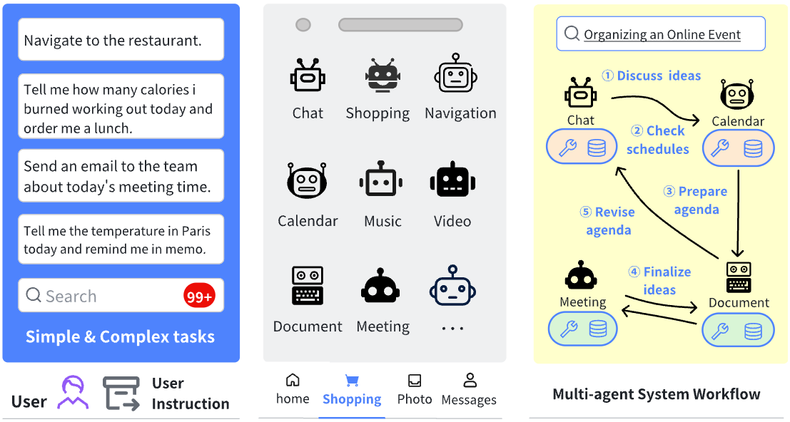

# 📚 Paper Collection on [multi-LLM-agent system (MLAS)]

Welcome to the paper collection repository on **multi-LLM-agent system (MLAS)**! This repository serves as a curated list of significant papers, reviews, and resources related to MLAS. Contributions are highly encouraged! 🚀

---
## 🔍 Introduction

In the era of large language models (LLMs), autonomous LLM agents have transformed how tasks are executed. These agents interact with their environment and external tools, extending their capabilities to complete complex tasks efficiently and effectively.

As the next evolution, Multi-LLM-Agent Systems (MLAS) enable multiple LLM agents to collaborate within a unified ecosystem. By combining their strengths, MLAS offers several key advantages:
- Enhanced Problem-Solving: Synergistic collaboration among agents leads to improved performance.
- Flexibility and Scalability: Modular architectures adapt easily to changing requirements.
- Data Privacy: Participating entities retain control over proprietary data, fostering trust.
- Monetization Opportunities: Individual agents or systems can monetize their specialized contributions.

This repository serves as a curated collection of significant papers and resources on MLAS, covering its technical foundations, practical implementations, and business potential. Dive in to explore the latest advancements in this exciting field! 🚀

---

## 🎯 Featured Paper

**Multi-LLM-Agent Systems: Techniques and Business Perspectives**

*Yingxuan Yang, Qiuying Peng, Jun Wang, Weinan Zhang*

[arXiv:(https://arxiv.org/abs/2411.14033)]



Key Contributions:
1.  Provides a systematic overview of MLAS architectures and mechanisms
2.  Analyzes security challenges and defense strategies
3.  Explores business models and monetization approaches
4.  Presents practical case studies of MLAS implementations
   
---

## 📂 Table of Contents

1. [Introduction](#introduction)
2. [Categories](#categories)
    - [Category 1](#🏗️ System Architecture & Frameworks)
    - [Category 2](#🤝 Agent Collaboration & Communication)
    - [Category 3](#🔒 Privacy & Security)
    - [Category 4](#💡 Applications & Use Cases)
3. [Contributing](#contributing)
4. [References](#references)

---

## 🗂 Categories

Organize papers into clear categories. Here's an example:

### 🧠 Category 1: [Specific Subfield or Focus Area]

1. **[Paper Title](link-to-paper)**  
   *Author(s)* - *Conference/Journal (Year)*  
   Summary: [Brief description or key contributions of the paper.]

2. **[Paper Title](link-to-paper)**  
   *Author(s)* - *Conference/Journal (Year)*  
   Summary: [Brief description or key contributions of the paper.]

### 📊 Category 2: [Another Subfield or Area]

1. **[Paper Title](link-to-paper)**  
   *Author(s)* - *Conference/Journal (Year)*  
   Summary: [Brief description or key contributions of the paper.]

...add more categories and papers as needed.

---

## 💡 Contributing

We welcome contributions! Here's how you can help:

1. Fork the repository.
2. Add new papers, reviews, or corrections.
3. Submit a pull request with your changes.

Please ensure the following:
- Provide proper citations and links to the original papers.
- Include a brief summary (2-3 sentences) for each paper.
- Maintain alphabetical or chronological order within categories.

---

## 📖 References

List general references, key textbooks, or online resources that are relevant to the topic.

---

## 📜 Citation

If you find this useful in your research, please consider citing
```
@misc{yang2024multillmagentsystemstechniquesbusiness,
      title={Multi-LLM-Agent Systems: Techniques and Business Perspectives}, 
      author={Yingxuan Yang and Qiuying Peng and Jun Wang and Weinan Zhang},
      year={2024},
      eprint={2411.14033},
      archivePrefix={arXiv},
      primaryClass={cs.AI},
      url={https://arxiv.org/abs/2411.14033}, 
}
```

---

## 🏆 Acknowledgments

Special thanks to all contributors and authors whose work is included in this repository.

